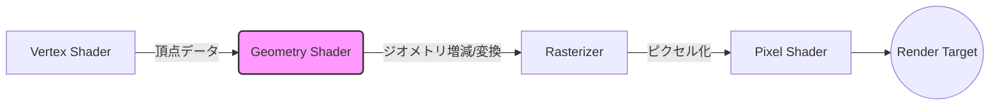
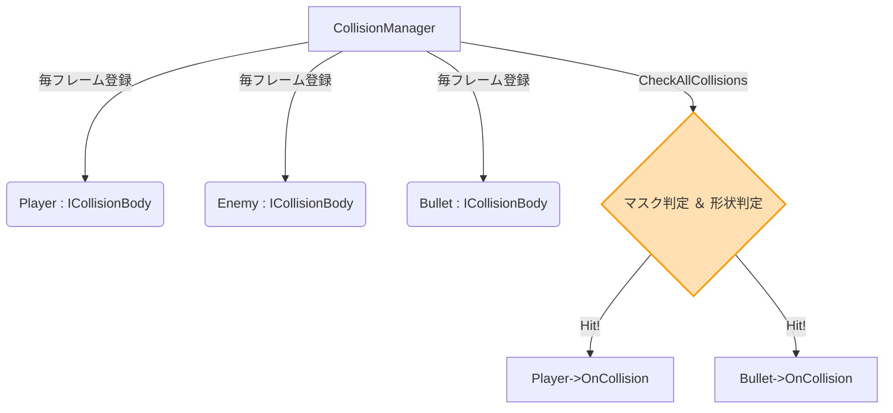
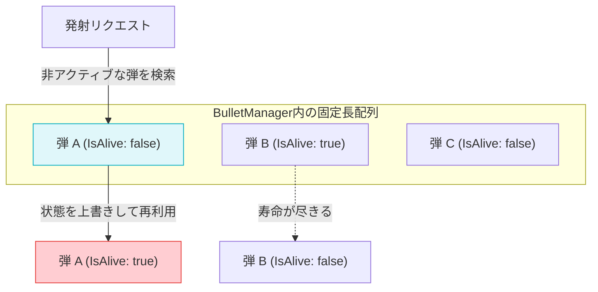
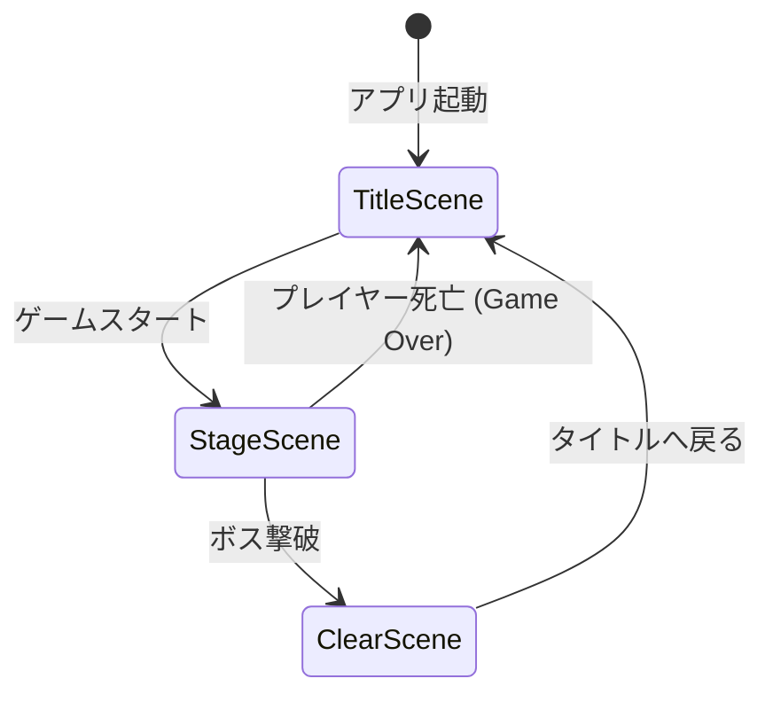

# ポートフォリオ資料：Antigravityエンジン & ゲーム

---

# 目次

## 作品紹介
- **p3. 自作エンジン開発の経験** (DirectX 12ベースの描画・基盤システム)
- **p4. 個人制作のゲーム概要** (3Dシューティング / 誘導ミサイルシステム)

## 作品のこだわり
- **p5~7. SceneManager・CollisionManagerの実装** (スマートポインタによるメモリ管理と3D/2D衝突判定)
- **p8. GPU Particle実装** (インスタンシング描画を活用した大量パーティクル制御)
- **p9~10. ObjectPoolを用いた弾の管理** (BulletManagerによるメモリ最適化と軌跡描画)
- **p11~13. StatePatternを用いた各種実装** (ISceneインターフェースによる状態遷移)
- **p14. Assimpを活用した自作モデルローダー** (OBJ / glTF対応と自動座標変換)

---

 

# 作品紹介

## p3. 自作エンジン開発の経験
**DirectX 12ベースのカスタムC++エンジン「Antigravity」**
- **目的**: 既存のゲームエンジンに依存せず、グラフィックスAPIの低レイヤーから描画基盤を構築することで、DirectX 12のアーキテクチャやレンダリングパイプラインの深い理解を得ること。
- **実装**: デバイス生成からコマンドリスト、スワップチェーン、フェンス同期までの基盤を構築。VS -> GS -> PS の3ステージパイプライン（Geometry Shader対応）を実装し、Phong/Blinn-Phong反射や複数光源制御に対応。また、Media FoundationとXAudio2によるオーディオ再生基盤も作成しました。
- **もたらした結果**: エンジンの根幹部分から自作したことで、ポストエフェクトや高度なシェーダーを自由に実装できる高い拡張性を獲得しました。（関連コミット: `shaderを改修 cso方式の読み込みへ`, `radialblurを実装`, `dissolveを実装` など）

## p4. 個人制作のゲーム概要
**データ駆動型ウェーブシステムを採用した3Dシューティング**
- **目的**: プランナーやレベルデザイナーがパラメータ調整のみでゲームバランスやステージ構成を変更できる柔軟な環境を作ること。また、快適な操作性と本格的な3D表現を両立させること。
- **実装**: JSONデータ（`enemy_data.json`）を用いたデータ駆動型の敵スポーンシステムと、スクリーン座標変換を活用した半自動ロックオン＆誘導ミサイルシステムを構築。操作面では、マウスPID制御やジンバルロック対策を導入しました。
- **もたらした結果**: 敵の出現パターンやバランス調整をプログラムの再コンパイルなしで高速にイテレーションできるようになりました。また、複雑な3Dエイム操作も直感的に行える手触りの良さを実現しています。（関連コミット: `マウスPID導入`, `マウスエイムコントロール微修正(ジンバルロック解決)` など）

---

 

# 作品のこだわり

## p5~7. SceneManager・CollisionManagerの実装
**安全なメモリ管理と汎用的な衝突判定機構**

- **SceneManager**
  - **目的**: 手動でのメモリ管理（`new/delete`）によるメモリリークやクラッシュのリスクを排除し、安全なシーン遷移基盤を構築すること。
  - **実装**: シーンのライフサイクル管理において `std::unique_ptr<IScene>` を採用し、メモリの自動解放を行いました。
  - **もたらした結果**: メモリ消し忘れ等のバグを構造上完全に防止。開発者がメモリ管理を意識せず、ゲームロジックの実装に専念できる環境を実現しました。

- **CollisionManager**
  - **目的**: オブジェクト間の依存関係をなくして拡張性を高めつつ、大量のオブジェクトが存在しても処理落ちしない衝突判定の仕組みを作ること。
  - **実装**: `ICollisionBody3D` インターフェースを用いたコライダー登録と、属性(Attribute)・マスクを利用したレイヤー分けによる対象の絞り込み（最適化）を構築しました。
  - **もたらした結果**: 無駄な判定をスキップし処理負荷を大幅に削減（高いFPSを維持）。また、各クラスが疎結合になり、新しい敵やギミックの追加が非常に容易になりました。

## p8. GPU Particle実装
**インスタンシング描画による高速化**
- **目的**: 爆発やマズルフラッシュなどのリッチなVFXを表現する際、CPUでの計算・描画発行によるパフォーマンス低下（ボトルネック）を解消し、大量のパーティクルを出せるようにすること。
- **実装**: CPU側で1つ1つドローコールを発行するのではなく、**GPUインスタンシング**を用いて1回の描画コマンドで最大1024個以上のパーティクルを並列処理。加速度フィールドやAABB判定を用いた物理的な挙動も取り入れました。
- **もたらした結果**: 描画負荷を劇的に下げつつ、画面を覆うような派手なエフェクト（爆発や煙など）を60FPSを保ちながら実装可能になり、ゲームのビジュアルクオリティが大幅に向上しました。（関連コミット: `GPUparticle(error`, `爆発(仮)`, `マズルフラッシュ改修` など）

## p9~10. ObjectPoolを用いた弾の管理
**`BulletManager` によるメモリ最適化**
- **目的**: 毎フレーム大量に発射・消滅する「弾（Bullet）」によるメモリの断片化や、動的確保（`new/delete`）のオーバーヘッドによる処理落ちを防ぐこと。
- **実装**: あらかじめ初期化時に `bullets_.resize(maxBullets)` で必要なメモリを固定長で一括確保する **ObjectPoolパターン** を採用。発射時は非アクティブ（`IsAlive() == false`）な弾を探して再利用（`Spawn`）し、寿命が来たらフラグを下げる設計としました。
- **もたらした結果**: 弾の生成・破棄にかかるCPUコストがほぼゼロになり、ガベージコレクションやメモリ断片化によるスパイク（突発的なカクつき）を完全に排除。大量の弾幕を張っても安定した動作を実現しました。

## p11~13. StatePatternを用いた各種実装
**`IScene` インターフェースによる状態遷移管理**
- **目的**: ゲーム全体の進行（Title → Stage → Clear）の遷移処理を整理し、スパゲッティコード化を防いで新しいシーンを安全に追加しやすくすること。
- **実装**: **State Pattern（状態パターン）** を設計に取り入れ、全てのシーンで共通の `IScene` インターフェース（`Initialize`, `Update`, `Draw`, `Finalize`）を実装。SceneManagerはポリモーフィズムによって統一的に更新・描画処理を呼び出すようにしました。
- **もたらした結果**: SceneManager側は現在の状態がどのシーンクラスであるかを意識する必要がなくなり、新しいシーン（例えばGameOverSceneなど）の追加や遷移ロジックの変更が、他のコードに影響を与えずに行えるようになりました。

## p14. Assimpを活用した自作モデルローダー
**OBJ / glTF形式対応と座標変換**
- **目的**: 汎用的な3Dフォーマットを自作エンジン上で手軽に扱えるようにし、Blender等のDCCツールから出力したリッチな3Dモデルを描画できるようにすること。
- **実装**: 商用エンジンでも使われる外部ライブラリ「**Assimp (Open Asset Import Library)**」を統合。右手系（Assimp）から左手系（DirectX）への座標変換（X軸反転など）や、再帰的なノード階層のパース処理を自前で実装しました。
- **もたらした結果**: 単なるOBJだけでなくモダンな **glTF形式** にも対応し、自前で複雑なバイナリパースを書くことなく様々な3Dモデルを即座にゲーム内に組み込めるアセットパイプラインが完成しました。

---

 

## 開発の軌跡（Gitコミット履歴より）
本プロジェクトは継続的な改善と機能追加を行ってきました。実際のコミット履歴からも、エンジン機能の拡張やゲーム体験（手触り）を向上させるための試行錯誤の過程が確認できます。
- **グラフィックスの高度化**: `shaderを改修 cso方式の読み込みへ`, `radialblurを実装`, `dissolveを実装`, `vignetteをハードコードからパラメータへ`
- **操作性と表現の磨き込み**: `マウスPID導入`, `マウスエイムコントロール微修正(ジンバルロック解決)`, `マズルフラッシュ改修`, `フリーカメラ実装`
- **デバッグ・開発環境改善**: `フォントから文字入力だけで表示できるように`, `imguiにposteffectがかからないように`
